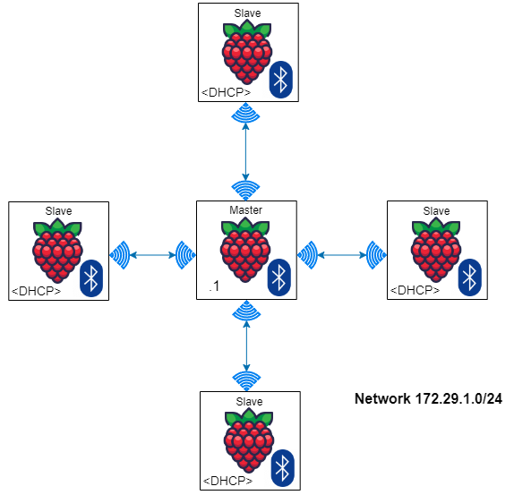

# IP-over-BLE Star Network

## Introduction
IP-over-BLE was tested as a Proof-of-Concept (PoC), and has several limitations compared to Wi-Fi mesh, including Inflexibility of topology, Shorter range, and Lower bandwidth/data rate, with the only noteworthy advantage being that BLE is significantly more energy/power efficient compared to Wi-Fi. Nevertheless, it could be handy for facilitating short-range, peer-to-peer transactions if a strong use case were identified.

There are considerable ongoing efforts to define IPv6-over-BLE network standards, however for our workshop we required IPv4 connectivity, which has no officially recognized network standard for integration with a BLE link layer. This feature can however be easily implemented by leveraging [BlueZ](https://github.com/bluez/bluez), which is the bluetooth stack implemented in Linux. Linux kernels 3.4 and later include Bluez 5.0 or later, and in particular version `5.55-3.1+rpt1` was used for our testing.
To simplify BlueZ implementation of IPv4-over-BLE, we additionally used the [bluez-tools](https://github.com/khvzak/bluez-tools) package (tested with version `2.0-20170911.0.7cb788c-4`) which has some functionality to readily implement bluetooth network access.

## Required packages
- Bluez:        `$ sudo apt-get install bluez`
- Bluez-tools:  `$ sudo apt-get install bluez-tools`


## Description
Bluetooth uses Time-Division Multiple Access (TDMA) for channel access, as opposed to Wi-Fi which uses CSMA. This means that in a bluetooth network, one node is designated as the master, and this node polls the other (slave) nodes for communications to occur. This is the reason for the inflexible topology, which is essentially a star with the master node in the center.

Additionally, for IP-over-BLE, the master node acts as a DHCP server to issue IP addresses to connecting bluetooth peers.


## Topology
 


## Instructions
It is *strongly* recommended to set the bluetooth hostname on each device before attempting to configure anything. Otherwise you will end up with several bluetooth devices all named __raspberrypi__ and no idea which is which when trying to discover & peer.
To set the bluetooth hostname, create the `/etc/machine-info` file with the following content, replacing &lt;device-name&gt; with your desired bluetooth name:
```
PRETTY_HOSTNAME=<device-name>
```


### To configure the Master node:
1. Create the bridge interface file (ex. pan0) at `/etc/systemd/network/pan0.netdev` with the following content:
```
[NetDev]
Name=pan0
Kind=bridge
```

2. Create the network settings file at `/etc/systemd/network/pan0.network` with the following content:
```
[Match]
Name=pan0

[Network]
Address=172.29.1.1/24
DHCPServer=yes
```
__N.B.__ - If connected devices should not use the BLE channel to accessing external network, add the `EmitRouter=no` line in the **Network** section of the above file.

3. Register the bluetooth agent service by creating the following file at `/etc/systemd/system/bt-agent.service`:
```
[Unit]
Description=Bluetooth Auth Agent

[Service]
ExecStart=/usr/bin/bt-agent -c NoInputNoOutput
Type=simple

[Install]
WantedBy=multi-user.target
```

4. Register the bluetooth network access service by creating the following file at `/etc/systemd/system/bt-network.service`:
```
[Unit]
Description=Bluetooth NAP PAN
After=pan0.network

[Service]
ExecStart=/usr/bin/bt-network -s nap pan0
Type=simple

[Install]
WantedBy=multi-user.target
```

5. Enable & start the required services:
```
$ sudo systemctl enable --now systemd-networkd
$ sudo systemctl enable --now bt-agent
$ sudo systemctl enable --now bt-network
```


### To configure Slave nodes:
No configuration is required; simply enable bluetooth, discover & peer with the master, and run the following command:
```
bt-network -c <bluetooth name or address of Master> nap
```
_Note_ - The above command uses the **bluetooth** name or 48-bit **bluetooth** address or address of the master, not the IP hostname or IP address.
  
## Known Issues & Workarounds:
1. The built-in bluetooth manager for Raspberry Pi OS often has issues detecting, pairing, and/or connecting with other devices (especially other Pi's). We found that the behavior was more consistent using [Blueman](https://github.com/blueman-project/blueman) bluetooth manager: `$ sudo apt-get install blueman`. 
_It is recommended to reboot after installing Blueman._
  
2. Over repeated implementations of this topology we found that occasionally, after configuring the master and attempting to connect a slave, the slave would give an error saying `Network service is not supported by this device`. After removing/deleting the configuration changes described in the above section "_To configure the Master node_", rebooting the master, and performing those configuration changes again (doing nothing differently), we found that on subsequent attempts the slaves would connect without issue. 

3. Occasionally we would observe page/segmentation faults crashing the bt-network connection from the slave nodes. It was unclear what triggered these errors, but they generally were not a significant issue. Reconnecting (by running the script in the above section "_To configure Slave nodes_") or rebooting generally resolved these problems.

_Final Note_ - This setup is very much a hack and should not be considered an enterprise solution; stability and consistency may vary.

___
[Home](/../../) - BLE Star - [Wi-Fi Mesh](../WIFI_mesh)
