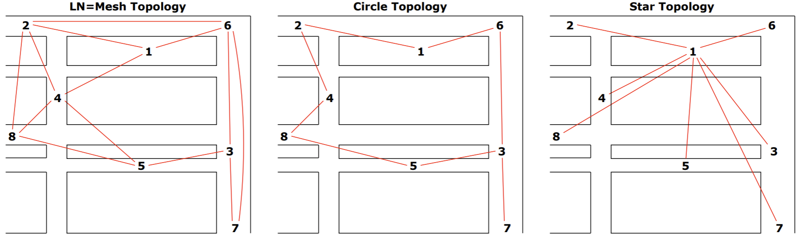

# LNMesh

## Introduction
In this workshop, we implement a local Lightning Network (LN) cluster of several nodes which may continue to operate and process transactions offline for a period if internet connectivity is lost. 

## System Info
This implementation was done using several Raspberry Pi 4 model B units, system details as follows:
- System - Raspberry Pi OS
- Architecture: 64-bit OS
- Kernel Version: 5.15.61
- Debian Version: 11 (bullseye)

Two types of underlying IP networks were used during testing (click for individual details):
1. [IP-over-Bluetooth Low Energy (BLE) network](BLE_star)        (Star topology, inflexible)
2. [Ad-hoc Wi-Fi mesh network](WIFI_mesh)                         (Mesh topology, flexible)

LN channels are then established on top of this IP connectivity.

## Installing LN & Opening channels

For this workshop, we used Core Lightning but other implementations of Lightning can also be used.

To install Core Lightning on the Pis, follow the steps in their official repository: [Core Lightning - Get Started][core-lightning]

We used Bitcoin's Testnet for our tests.

Once each Pi has the Bitcoin Core and Core Lightning installed and fully synched, we can open some channels between the Pis.

Channels can be opened arbitrarily or based on some strategy. We tested the following 3 topologies:

 

## Cutting the Internet Connection
Once the channels are ready, we cut the Internet connection on all the Pis.

___
Home - [BLE Star](BLE_star) - [Wi-Fi Mesh](WIFI_mesh)

[core-lightning]: https://docs.corelightning.org/docs/getting-started