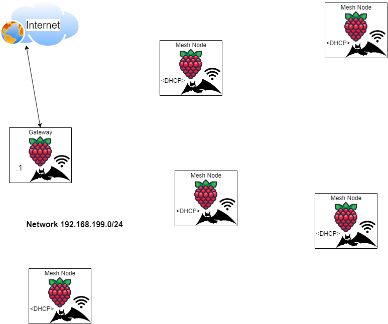

#   Ad-hoc Wi-Fi Mesh Network

## Introduction
Wi-Fi typically operates in one of 2 modes: Infrastructure mode or Ad-hoc mode. 

In infrastructure mode, the immediate network can be considered a star topology, with the Access Point (AP) as the center of the star, and associated wireless clients at the outer vertices. In this topology, if 2 clients wish to communicate with each other, the traffic is relayed through the AP to the destination in a maximum of 2 hops (provided that they are associated with the same AP). This is very similar to the BLE star topology discussed previously, with the BLE master node being similar to the wireless AP&ast;. For a closed environment, as the central node is aware of all nodes, no routing protocol is needed; nodes simply send their traffic through the AP, who then forwards it to its destination. A significant drawback of this however is that communication range is limited and centered around the AP. 

In ad-hoc mode, each node can communicate directly with any other in-range node, and traffic can be relayed through these nodes (one or more times) to communicate with out-of-range nodes. This is not an out-of-the-box solution though, as a routing protocol is needed to correctly establish a forwarding structure for the overall network. To accomplish this, the [Better Approach to Mobile Ad-hoc Networking (B.A.T.M.A.N.)](http://www.open-mesh.org) protocol was used, which has been included in the official Linux kernel since 2.6.38. Additionally, we use a utility called `batctl` to manage the mesh network.

&ast; - <i>There are other technical discrepancies between the operation of Wi-Fi and BLE, however they will not be discussed in detail here; for our project it is helpful to recognize the similaritie in topology between Bluetooth and Wi-Fi Infrastructure mode.</i>

## Required packages

- Batctl: `$ sudo apt-get install batctl`
- DNSmasq: `$ sudo apt-get install dnsmasq` 

<i>N.B.</i> - The rc-local service is used to enable the mesh network at boot time. This service is no longer included on Ubuntu 16.10 and later, but there are numerous online guides showing how to manually create it &#40;[example](https://marsown.com/wordpress/how-to-enable-etc-rc-local-with-systemd-on-ubuntu-20-04/)&#41;. Alternatively, you could create your own service instead of using rc-local &#40;[example](https://marsown.com/wordpress/how-to-enable-etc-rc-local-with-systemd-on-ubuntu-20-04/)&#41;. 

## Description

In our mesh topology, we designate one node as an internet gateway, DHCP server, and DNS server for the rest of the network. This internet access could be provided by any secondary network interface on the device; ethernet, addtional wireless radios, etc., but it is not possible to use the same wlan interface that is being used for the mesh network to connect to another SSID with internet access.

Batctl identifies the nodes by their MAC addresses, which can get somewhat confusing to interpret as we create a separate interface (bat0) for the mesh network that is tied to the wlan interface of each node, but has its own MAC address. To simplify administration & troubleshooting of the mesh, we also configure a local domain.


## Topology
 
Nodes can communicate directly with all other node(s) within range, indirectly with out of range nodes via node(s) in range

## Instructions

<i>N.B.</i> - Instructions adapted from [binnes](https://github.com/binnes/WiFiMeshRaspberryPi)

### Pre-setup

It is best to ensure that each node that will be participating in the mesh network has a unique hostname, as we will be using these hostnames in place of IP addresses once they have joined.

### General:

These steps should be repeated for all nodes that will be part of the mesh network.

1. Install batctl
```
$ sudo apt-get install batctl
```

2. Create the `~/start-batman-adv.sh` script, with the following content, replace `wlan0` with the name of your wireless interface if different (both in filename and subsequent content):
```
#!/bin/bash
# batman-adv interface to use
sudo batctl if add wlan0
sudo ifconfig bat0 mtu 1468

# Tell batman-adv this is a client node
sudo batctl gw_mode client

# Tell batman-adv this is a gateway node
# sudo batctl gw_mode server

# Activates the interfaces for batman-adv
sudo ifconfig wlan0 up
sudo ifconfig bat0 up
```

3. Make the script executable:
```
chmod +x ~/start-batman-adv.sh
```

4. Create/edit the network interface definition for the wireless interface to be used in ad-hoc mode, ex. `/etc/network/interfaces.d/wlan0`, replace `wlan0` with the name of your wireless interface if different (both in filename and subsequent content):
```
auto wlan0
iface wlan0 inet manual
    wireless-channel 1
    wireless-essid pi-mesh
    wireless-mode ad-hoc
```
<i>N.B.</i> You may replace the channel number (2.4GHz wireless typically supports channels 1-11) and/or essid with one of your choosing, however these values **must** be the same for all nodes participating in the mesh.

5. Ensure the batman-adv kernel module is loaded at boot time:
```
echo 'batman-adv' | sudo tee --append /etc/modules
```

6. Stop the DHCPD process from running on the wireless interface that is being used for the mesh network, replace `wlan0` if you are using something else:
```
echo 'denyinterfaces wlan0' | sudo tee --append /etc/dhcpcd.conf
```

7. Ensure the script runs at boot time by adding the following line to `/etc/rc.local`:
```
/home/pi/start-batman-adv.sh &
```
<i>N.B.</i> If you have opted not to use the rc-local service, you will need to create a service to run the script at boot time, or run it manually if for some reason that is preferred.

8. If this device will not be a gateway node, shut it down for now:
```
sudo shutdown now
```

<i>N.B.</i>: See the [start-batman-adv-node.sh.sample](start-batman-adv-node.sh.sample) file for an example of the completed configuration.

The next sub-section focuses on how to convert one of these nodes into a gateway node for the mesh network.

### To configure the Gateway node:

The instructions in this section assume that one has already completed the steps in the previous sub-section to apply the basic configuration required for B.A.T.M.A.N.

1. Install dnsmasq
```
$ sudo apt-get install dnsmasq
```

2. Edit the `/etc/dnsmasq.conf` file to reflect the minimum configuration as provided in the [dnsmasq.txt.sample](dnsmasq.txt.sample)

3. Edit the `/home/pi/start-batman-adv.sh` file and change the mode from client to server:
```
# Tell batman-adv this is a client node
# sudo batctl gw_mode client            # comment out this line

# Tell batman-adv this is a gateway node
sudo batctl gw_mode server              # uncomment this line
```

4. Also add the following content to the `/home/pi/start-batman-adv.sh` file to enable IPv4 forwarding and add rules to enable external access for the mesh network (you can replace eth0 with a different interface if you choose):
```
# Enable IPv4 traffic forwarding between eth0 and bat0
sudo sysctl -w net.ipv4.ip_forward=1
sudo iptables -t nat -A POSTROUTING -o eth0 -j MASQUERADE
sudo iptables -A FORWARD -i eth0 -o bat0 -m conntrack --ctstate RELATED,ESTABLISHED -j ACCEPT
sudo iptables -A FORWARD -i bat0 -o eth0 -j ACCEPT
```

5. Add a line to the same file to configure an IP address for the gateway on the mesh network:
```
sudo ifconfig bat0 192.168.199.1/24
```

<i>N.B.</i>: See the [start-batman-adv-gw.sh.sample](start-batman-adv-gw.sh.sample) file for an example of the completed configuration for the gateway.

6. Reboot the gateway
```
$ sudo reboot now
```

## Bring up the mesh network & verify connectivity
Now that the gateway has been appropriately configured to provide external access for the mesh, you can proceed to power up the other nodes and verify connectivity.
Some basic checks you can perform include:

1. Issue the command `ifconfig` on the gateway. At minimum, you should see the `bat0`, `eth0`, and `wlan0` interfaces up and communicating (or whatever you had used to complete the configuration). You should notice that:
- eth0 has an IP address on your home/office network
- bat0 has IP address 192.168.199.1
- wlan0 has no IP address assigned

2. Issue command `iwconfig` to show the wireless interfaces on the device. You should see something like:
```
wlan0   IEEE 802.11  ESSID:"pi-mesh"  
        Mode:Ad-Hoc  Frequency:2.462 GHz  Cell: 3A:BC:74:3B:A1:D9
        Tx-Power=31 dBm
        Retry short limit:7   RTS thr:off   Fragment thr:off
        Power Management:on
```
Note that:
- The ESSID is the name of your network, set in /etc/network/interfaces.d/wlan0
- The mode is Ad-Hoc

3. Issue command `sudo batctl` if to show the interfaces participating in the mesh. You should see response wlan0: active to show that the WiFi interface wlan0 is part of the mesh.

4. Issue command `sudo batctl n` to show the neighbouring mesh nodes your gateway node can see. You should see something similar to this:
```
[B.A.T.M.A.N. adv 2018.3, MainIF/MAC: wlan0/b8:27:eb:8e:ec:6c (bat0/ba:bf:0a:fd:33:e5 BATMAN_IV)]
IF             Neighbor             last-seen
    wlan0       b8:27:eb:bd:4d:e5   0.980s
    wlan0       b8:27:eb:01:d4:bb   0.730s
...
```

5. When using the `batctl` command it is not very helpful to show mac addresses for each of the mesh nodes. It is possible to create a file which will map a mac address to a hostname. Create a file /etc/bat-hosts as root user and add the mac addresses and host names of all your mesh nodes. The mac address used is the ether value of the wlan0 interface node on each node. A sample /etc/bat-hosts file looks like:
```
b8:27:eb:8e:ec:6c   bi-raspimesh01
b8:27:eb:bd:4d:e5   bi-raspimesh02
b8:27:eb:01:d4:bb   bi-raspimesh03
```
For consistency, use the same hostnames here as the hostnames of each respective node.

Now when you run `sudo batctl n` you should now get:
```
[B.A.T.M.A.N. adv 2017.3, MainIF/MAC: wlan0/b8:27:eb:8e:ec:6c (bat0/ba:bf:0a:fd:33:e5 BATMAN_IV)]
IF             Neighbor             last-seen
    wlan0       bi-raspimesh02      0.890s
    wlan0       bi-raspimesh03      0.660s
...
```
Create the /etc/bat-hosts file on all of the mesh nodes if you want the mac addresses resolved to hostnames in `batctl` commands.

6. Issuing the `ifconfig` command on the other mesh nodes should show at minimum the `bat0` and `wlan0` interfaces, and interface `bat0` should have an IP address assigned by the gateway node. If an IP address is not assigned to `bat0`, run `sudo dhclient -v bat0` to manually start the dhcp client on the interface.

7. From any of the connected nodes, you should be able to `ping` any of the other nodes in the mesh network, and given that we went through the additional trouble of setting up a local domain for our environment, you should be able to ping by hostname, not just ip.

8. From any of the connected nodes, you should also be able to reach external networks (ex. internet access) via your gateway node. 

## Advanced
B.A.T.M.A.N. advanced operates on layer 2. Thus all hosts participating in the virtual switched network are transparently connected together for all protocols above layer 2. Therefore the common diagnosis tools do not work as expected. To overcome these problems batctl contains the commands ping, traceroute, tcpdump which provide similar functionality to the normal `ping`, `traceroute`, `tcpdump` commands, but modified to layer 2 behaviour or using the B.A.T.M.A.N. advanced protocol.

See the [batctl](https://manpages.ubuntu.com/manpages/jammy/man8/batctl.8.html) manpage for your distro for more detailed explanations.


## Known Issues & Workarounds:
- None, we found that this setup was pretty consistent
  
___
[Home](/../../) - [BLE Star](../BLE_star) - Wi-Fi Mesh
